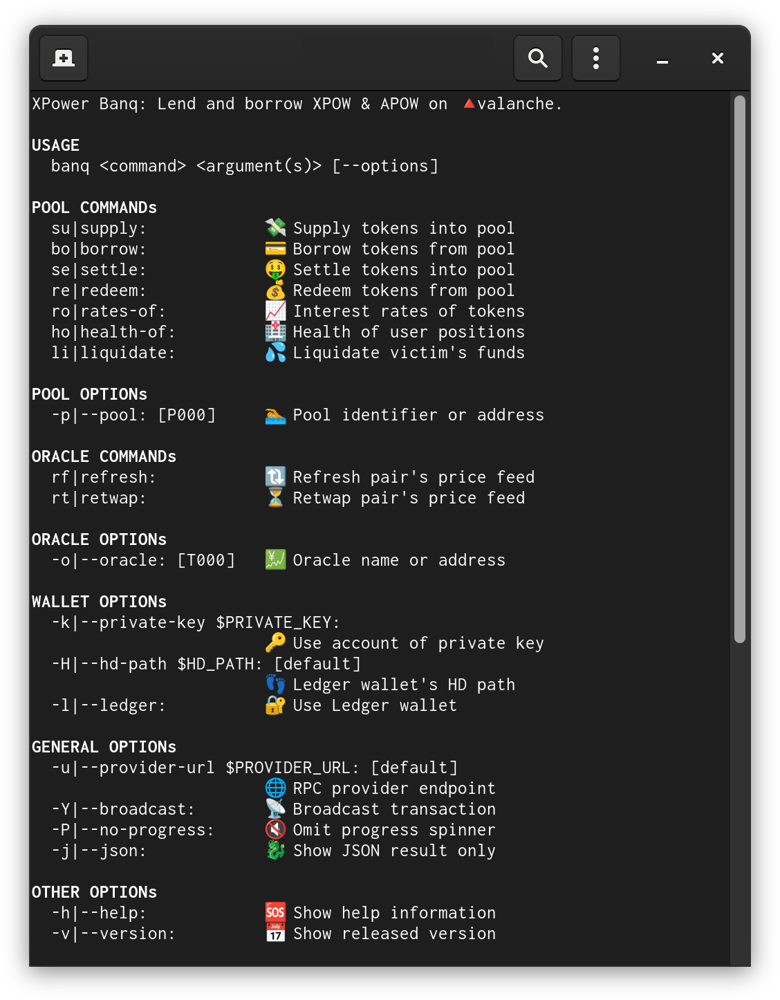

[](https://deepwiki.com/blackhan-software/xpower-banq-cli)

# XPower Banq CLI: Lending & Borrowing

> Lend and borrow XPOW & APOW tokens; see also [xpowermine.com]! ⛏️⚡️

[xpowermine.com]: https://www.xpowermine.com



## Build

⚒️ Install dependencies: requires [deno] `v2.0.0` (or higher)

```sh
deno run install
```

👷 Build `banq` distributables: for Linux, macOS and Windows (64 bit)

```sh
deno run build-banq
```

[deno]: https://deno.com/

## Installation

💾 Copy `banq.x86_64-*.run` (or `*.exe`) to an installation folder:

```sh
[sudo] cp ./dist/banq.x86_64-linux.run /usr/local/bin/banq
```

🏦 Mark `banq` as an executable: on Linux (et al.)

```sh
[sudo] chmod +x /usr/local/bin/banq
```

## Usage

📜 Define the contract-run version: optional

```sh
export CONTRACT_RUN=v10a # default: v10a, v10b etc.
```

🌐 Define the URL of an Avalanche RPC provider: optional

```sh
export PROVIDER_URL=https://api.avax.network/ext/bc/C/rpc # default
```

🔑 Define the private-key of your user account: conditional

```sh
export PRIVATE_KEY=0x... # required -- unless the Ledger HW is used
```

🏦 Invoke the `banq` command-line interface:

```sh
banq --help
```

```sh
banq <command> <argument(s)> [--option(s)]
```

### Position Management

💸 Supply `APOW` tokens: into `pool=P000`

```sh
banq supply 1.0 APOW [--pool=P000] [-Y|--broadcast]
```

💳 Borrow `XPOW` tokens: from `pool=P000`

```sh
banq borrow 1.0 XPOW [--pool=P000] [-Y|--broadcast]
```

🤑 Settle `XPOW` tokens: into `pool=P000`

```sh
banq settle 1.0 XPOW [--pool=P000] [-Y|--broadcast]
```

💰 Redeem `APOW` tokens: from `pool=P000`

```sh
banq redeem 1.0 APOW [--pool=P000] [-Y|--broadcast]
```

### Position Reindexing

🎡 Reindex supplied `APOW` tokens: in `pool=P000`

```sh
banq reindex APOW --mode=supply [--pool=P000] [-Y|--broadcast]
```

🎡 Reindex borrowed `XPOW` tokens: in `pool=P000`

```sh
banq reindex XPOW --mode=borrow [--pool=P000] [-Y|--broadcast]
```

### User Management

🏥 Health of `$USER`'s positions: in `pool=P000`

```sh
banq health-of $USER [--pool=P000] [-Y|--broadcast] # USER=0x..
```

💦 Liquidate `$USER`'s positions: in `pool=P000`

```sh
banq liquidate $USER [--pool=P000] [-Y|--broadcast] # USER=0x..
```

### Oracle Management

💱 Refresh `XPOW/APOW` feed: for `oracle=T000`

```sh
banq refresh XPOW APOW [--oracle=T000] [-Y|--broadcast] # permissioned?
```

🔃 Retwap `XPOW/APOW` feed: for `oracle=T000`

```sh
banq retwap XPOW APOW [--oracle=T000] [-Y|--broadcast] # permissioned!
```

### Interest Rates

📈 Supply and borrow rate(s) of `XPOW`: in `pool=P000` at (±) index

```sh
banq rates-of XPOW [--pool=P000] [-@|--at=now] [-Y|--broadcast]
```

📉 Supply and borrow rate(s) of `APOW`: in `pool=P000` incl. history

```sh
banq rates-of APOW [--pool=P000] [-@|--at=all] [-Y|--broadcast]
```

### XPOW Mining & Minting

🏁 Initialize `XPOW` mining: run once per hour

```sh
banq xpow-init [-Y|--broadcast]
```

⛏️ Mine `XPOW` tokens: piped to e.g. `netcat` (OpenBSD)

```sh
banq xpow-mine [-Y|--broadcast] -Pj --pow-level=8 | nc 127.0.0.1 8765
```

⚡ Mint `XPOW` tokens: piped e.g. from `netcat` (OpenBSD)

```sh
nc -l 8765 | banq xpow-mint [-Y|--broadcast] -Pj \
--max-priority-fee-per-gas=0 \
--max-fee-per-gas=500000000 \
--gas-limit=100000
```

🐋 Docker:

> See: https://hub.docker.com/r/xpowermine/miner

## Development

```sh
cp .env.mainnet .env # or: cp .env.testnet .env
```

### Run

```sh
deno run -A --env=.env ./cli/banq/banq-main.ts
```

### Test

```sh
deno test -A
```

### Lint

```sh
deno lint
```

### Format

```sh
deno fmt
```

### Help

```sh
deno help
```

## Copyright

© 2025 [Moorhead LLC](#)
