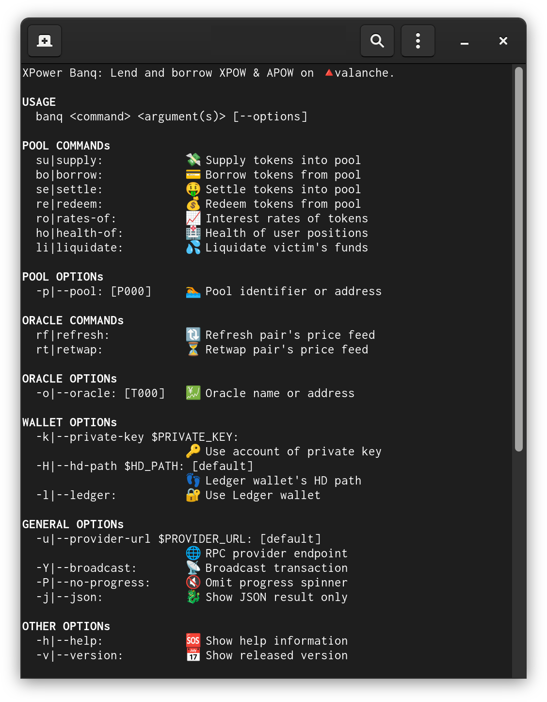

## XPower Banq CLI: Lending & Borrowing

> Lend and borrow XPOW & APOW tokens; see also [xpowermine.com]! ⛏️⚡️

[xpowermine.com]: https://www.xpowermine.com



## Build

⚒️ Install dependencies: requires [deno] `v2.0.0-rc.10` (or higher)

```sh
deno run install
```

🏁 Build `banq` distributables: for Linux, macOS and Windows (64 bit)

```sh
deno run build-banq
```

[deno]: https://deno.com/

## Installation

💾 Copy `banq.x86_64-*.run` (or `*.exe`) to an installation folder:

```sh
[sudo] cp ./dist/banq.x86_64-linux.run /usr/local/bin/banq
```

🏦 Mark `banq` as an executable: on Linux (et al.)

```sh
[sudo] chmod +x /usr/local/bin/banq
```

## Usage

🔑 Define the private-key of your user account: optional

```sh
export PRIVATE_KEY=0x... # required -- unless the Ledger HW is used
```

🌐 Define the URL of an Avalanche RPC provider: optional

```sh
export PROVIDER_URL=https://api.avax.network/ext/bc/C/rpc # default
```

🏦 Invoke the `banq` command-line interface:

```sh
banq --help
```

```sh
banq <command> <argument(s)> [--option(s)]
```

### Position Management

💸 Supply `APOW` tokens: into `pool=P000`

```sh
banq supply 1.0 APOW [--pool=P000] [-Y|--broadcast]
```

💳 Borrow `XPOW` tokens: from `pool=P000`

```sh
banq borrow 1.0 XPOW [--pool=P000] [-Y|--broadcast]
```

🤑 Settle `XPOW` tokens: into `pool=P000`

```sh
banq settle 1.0 XPOW [--pool=P000] [-Y|--broadcast]
```

💰 Redeem `APOW` tokens: from `pool=P000`

```sh
banq redeem 1.0 APOW [--pool=P000] [-Y|--broadcast]
```

### User Management

🏥 Health of `$USER`'s positions: in `pool=P000`

```sh
banq health-of $USER [--pool=P000] [-Y|--broadcast] # USER=0x..
```

💦 Liquidate `$USER`'s positions: in `pool=P000`

```sh
banq liquidate $USER [--pool=P000] [-Y|--broadcast] # USER=0x..
```

### Oracle Management

🔃 Refresh `XPOW/APOW` feed: for `oracle=T000`

```sh
banq refresh XPOW APOW [--oracle=T000] [-Y|--broadcast] # permissioned?
```

⏳ Retwap `XPOW/APOW` feed: for `oracle=T000`

```sh
banq retwap XPOW APOW [--oracle=T000] [-Y|--broadcast] # permissioned!
```

### Interest Rates

📈 Supply and borrow rate(s) of `XPOW`: in `pool=P000` at (±) index

```sh
banq rates-of XPOW [--pool=P000] [-@|--at=now] [-Y|--broadcast]
```

📉 Supply and borrow rate(s) of `APOW`: in `pool=P000` incl. history

```sh
banq rates-of APOW [--pool=P000] [-@|--at=all] [-Y|--broadcast]
```

## Development

```sh
cp .env.mainnet .env # or: cp .env.testnet .env
```

### Run

```sh
deno run -A ./cli/banq/banq-main.ts
```

### Test

```sh
deno test -A
```

### Lint

```sh
deno lint
```

### Format

```sh
deno fmt
```

### Help

```sh
deno help
```

## Bugs

### Ledger Hardware Wallet

Using the Ledger hardware wallet works _only_ from within the project, due to limited [deno] support for _native_ Node modules (like for `node-hid`, `keccak` or `usb`):

```sh
git clone https://github.com/blackhan-software/xpower-banq-cli
```

```sh
cd xpower-banq-cli && deno run install
```

```sh
cp .env.mainnet .env # or: cp .env.testnet .env
```

```sh
deno run banq --help # including --ledger|-l support!
```

## Copyright

© 2025 [Moorhead LLC](#)
